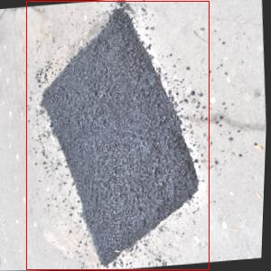

# 改进yolo11-ADown等200+全套创新点大全：道路坑洞及修补检测系统源码＆数据集全套

### 1.图片效果展示


##### 项目来源 **[人工智能促进会 2024.11.01](https://kdocs.cn/l/cszuIiCKVNis)**

注意：由于项目一直在更新迭代，上面“1.图片效果展示”和“2.视频效果展示”展示的系统图片或者视频可能为老版本，新版本在老版本的基础上升级如下：（实际效果以升级的新版本为准）

  （1）适配了YOLOV11的“目标检测”模型和“实例分割”模型，通过加载相应的权重（.pt）文件即可自适应加载模型。

  （2）支持“图片识别”、“视频识别”、“摄像头实时识别”三种识别模式。

  （3）支持“图片识别”、“视频识别”、“摄像头实时识别”三种识别结果保存导出，解决手动导出（容易卡顿出现爆内存）存在的问题，识别完自动保存结果并导出到tempDir中。

  （4）支持Web前端系统中的标题、背景图等自定义修改。

  另外本项目提供训练的数据集和训练教程,暂不提供权重文件（best.pt）,需要您按照教程进行训练后实现图片演示和Web前端界面演示的效果。

### 2.视频效果展示

[2.1 视频效果展示](https://www.bilibili.com/video/BV1oBDcYYEyc/)

### 3.背景

研究背景与意义

随着城市化进程的加快，城市道路的使用频率显著增加，导致道路设施的损坏情况日益严重。其中，坑洞作为一种常见的道路损坏形式，不仅影响了交通安全，还对行车舒适性造成了负面影响。坑洞的出现不仅增加了车辆的维修成本，还可能导致交通事故的发生，给社会带来不必要的经济损失。因此，及时、准确地检测和修补道路坑洞显得尤为重要。

近年来，计算机视觉技术的快速发展为道路坑洞检测提供了新的解决方案。YOLO（You Only Look Once）系列模型因其高效的实时目标检测能力，已成为众多视觉检测任务中的首选。然而，现有的YOLO模型在特定场景下的检测精度和鲁棒性仍有待提升。针对这一问题，本研究提出了一种基于改进YOLOv11的道路坑洞及修补检测系统，旨在通过优化模型结构和训练策略，提高对道路坑洞的检测性能。

本项目所使用的数据集“PotholesPatch”包含1500张图像，涵盖了“patch”和“pothole”两个类别。这一数据集为模型的训练和验证提供了丰富的样本，有助于提高模型在实际应用中的泛化能力。通过对数据集的深入分析与处理，结合改进的YOLOv11模型，我们期望能够实现对道路坑洞的高效检测，并为后续的修补工作提供准确的位置信息。

综上所述，本研究不仅具有重要的理论意义，还将为城市道路管理和维护提供切实可行的技术支持，推动智能交通系统的发展。通过建立高效的道路坑洞检测系统，我们希望能够降低道路维修成本，提高交通安全，进而提升城市居民的生活质量。

### 4.数据集信息展示

##### 4.1 本项目数据集详细数据（类别数＆类别名）

nc: 2
names: ['patch', 'pothole']


该项目为【目标检测】数据集，请在【训练教程和Web端加载模型教程（第三步）】这一步的时候按照【目标检测】部分的教程来训练

##### 4.2 本项目数据集信息介绍

本项目数据集信息介绍

本项目所使用的数据集名为“PotholesPatch”，旨在为改进YOLOv11的道路坑洞及修补检测系统提供强有力的支持。该数据集专注于道路表面缺陷的检测，具体包括两大类目标：修补（patch）和坑洞（pothole）。通过精确标注这两类目标，数据集为算法的训练和评估提供了丰富的样本，确保模型能够有效识别和分类不同类型的道路缺陷。

“PotholesPatch”数据集包含了多种环境和光照条件下的道路图像，确保了数据的多样性和代表性。这些图像来源于城市和乡村的不同道路，涵盖了各种类型的路面材料和结构，进一步增强了模型的泛化能力。每个图像都经过精细的标注，确保修补和坑洞的边界清晰可见，便于模型学习到准确的特征。

在数据集的构建过程中，特别关注了数据的质量和数量，以确保训练过程中的有效性。通过对不同类型的坑洞和修补的样本进行平衡，数据集提供了足够的样本量，以避免模型在训练过程中出现偏差。此外，数据集还考虑到了实际应用中的复杂情况，如坑洞的大小、形状和位置变化，使得模型在真实场景中的表现更加可靠。

总之，“PotholesPatch”数据集不仅为YOLOv11的训练提供了坚实的基础，还为后续的道路维护和管理提供了数据支持。通过对修补和坑洞的准确检测，期望能够提升道路安全性和行车舒适度，为智能交通系统的发展贡献力量。





### 5.全套项目环境部署视频教程（零基础手把手教学）

[5.1 所需软件PyCharm和Anaconda安装教程（第一步）](https://www.bilibili.com/video/BV1BoC1YCEKi/?spm_id_from=333.999.0.0&vd_source=bc9aec86d164b67a7004b996143742dc)


[5.2 安装Python虚拟环境创建和依赖库安装视频教程（第二步）](https://www.bilibili.com/video/BV1ZoC1YCEBw?spm_id_from=333.788.videopod.sections&vd_source=bc9aec86d164b67a7004b996143742dc)

### 6.改进YOLOv11训练教程和Web_UI前端加载模型教程（零基础手把手教学）

[6.1 改进YOLOv11训练教程和Web_UI前端加载模型教程（第三步）](https://www.bilibili.com/video/BV1BoC1YCEhR?spm_id_from=333.788.videopod.sections&vd_source=bc9aec86d164b67a7004b996143742dc)


按照上面的训练视频教程链接加载项目提供的数据集，运行train.py即可开始训练



     Epoch   gpu_mem       box       obj       cls    labels  img_size
     1/200     20.8G   0.01576   0.01955  0.007536        22      1280: 100%|██████████| 849/849 [14:42<00:00,  1.04s/it]
               Class     Images     Labels          P          R     mAP@.5 mAP@.5:.95: 100%|██████████| 213/213 [01:14<00:00,  2.87it/s]
                 all       3395      17314      0.994      0.957      0.0957      0.0843

     Epoch   gpu_mem       box       obj       cls    labels  img_size
     2/200     20.8G   0.01578   0.01923  0.007006        22      1280: 100%|██████████| 849/849 [14:44<00:00,  1.04s/it]
               Class     Images     Labels          P          R     mAP@.5 mAP@.5:.95: 100%|██████████| 213/213 [01:12<00:00,  2.95it/s]
                 all       3395      17314      0.996      0.956      0.0957      0.0845

     Epoch   gpu_mem       box       obj       cls    labels  img_size
     3/200     20.8G   0.01561    0.0191  0.006895        27      1280: 100%|██████████| 849/849 [10:56<00:00,  1.29it/s]
               Class     Images     Labels          P          R     mAP@.5 mAP@.5:.95: 100%|███████   | 187/213 [00:52<00:00,  4.04it/s]
                 all       3395      17314      0.996      0.957      0.0957      0.0845


###### [项目数据集下载链接](https://kdocs.cn/l/cszuIiCKVNis)

### 7.原始YOLOv11算法讲解

YOLOv11是一种由Ultralytics公司开发的最新一代目标检测模型，以其增强的特征提取能力和更高的效率在计算机视觉领域引人注目。该模型在架构上进行了关键升级，通过更新主干和颈部结构，显著提高了对复杂视觉场景的理解和处理精度。YOLOv11不仅在目标检测上表现出色，还支持实例分割、图像分类、姿态估计和定向目标检测（OBB）等任务，展示出其多功能性。

与其前身YOLOv8相比，YOLOv11在设计上实现了深度和宽度的改变，同时引入了几个创新机制。其中，C3k2机制是对YOLOv8中的C2f的改进，提升了浅层特征的处理能力；C2PSA机制则进一步优化了特征图的处理流程。解耦头的创新设计，通过增加两个深度卷积（DWConv），提高了模型对细节的感知能力和分类准确性。

在性能上，YOLOv11m模型在COCO数据集上的平均精度（mAP）提高，并减少了22%的参数量，确保了在运算效率上的突破。该模型可以部署在多种平台上，包括边缘设备、云平台以及支持NVIDIA GPU的系统，彰显出卓越的灵活性和适应性。总体而言，YOLOv11通过一系列的创新突破，对目标检测领域产生了深远的影响，并为未来的开发提供了新的研究方向。


****文档**** ： _ _https://docs.ultralytics.com/models/yolo11/__

****代码链接**** ： _ _https://github.com/ultralytics/ultralytics__

******Performance Metrics******


​ ** **关键特性****

****◆**** ** **增强的特征提取能力**** ：YOLO11采用了改进的主干和颈部架构，增强了 ** **特征提取****
能力，能够实现更精确的目标检测和复杂任务的执行。

****◆**** ** **优化的效率和速度****
：YOLO11引入了精细化的架构设计和优化的训练流程，提供更快的处理速度，并在准确性和性能之间保持最佳平衡。

****◆**** ** **参数更少、精度更高****
：通过模型设计的改进，YOLO11m在COCO数据集上实现了更高的平均精度（mAP），同时使用的参数比YOLOv8m少22%，使其在计算上更加高效，而不牺牲准确性。

****◆**** ** **跨环境的适应性**** ：YOLO11可以无缝部署在各种环境中，包括边缘设备、云平台和支持NVIDIA
GPU的系统，确保最大的灵活性。

****◆**** ** **支持广泛任务****
：无论是目标检测、实例分割、图像分类、姿态估计还是定向目标检测（OBB），YOLO11都旨在应对一系列计算机视觉挑战。

****支持的任务和模式****


​YOLO11建立在YOLOv8中引入的多功能模型范围之上，为各种计算机视觉任务提供增强的支持:


​该表提供了YOLO11模型变体的概述，展示了它们在特定任务中的适用性以及与Inference、Validation、Training和Export等操作模式的兼容性。从实时检测到复杂的分割任务
，这种灵活性使YOLO11适用于计算机视觉的广泛应用。

##### yolov11的创新

■ yolov8 VS yolov11

YOLOv5，YOLOv8和YOLOv11均是ultralytics公司的作品，ultralytics出品必属精品。


​ **具体创新点** ：

**① 深度（depth）和宽度 （width）**

YOLOv8和YOLOv11是基本上完全不同。

**② C3k2机制**

C3k2有参数为c3k，其中在网络的浅层c3k设置为False。C3k2就相当于YOLOv8中的C2f。


​ **③ C2PSA机制**

下图为C2PSA机制的原理图。


​ **④ 解耦头**

解耦头中的分类检测头增加了两个 **DWConv** 。


▲Conv

    
    
    def autopad(k, p=None, d=1):  # kernel, padding, dilation
    
        """Pad to 'same' shape outputs."""
    
        if d > 1:
    
            k = d * (k - 1) + 1 if isinstance(k, int) else [d * (x - 1) + 1 for x in k]  # actual kernel-size
    
        if p is None:
    
            p = k // 2 if isinstance(k, int) else [x // 2 for x in k]  # auto-pad
    
    return p
    
    
    class Conv(nn.Module):
    
        """Standard convolution with args(ch_in, ch_out, kernel, stride, padding, groups, dilation, activation)."""
    
    
        default_act = nn.SiLU()  # default activation
    
    
        def __init__(self, c1, c2, k=1, s=1, p=None, g=1, d=1, act=True):
    
            """Initialize Conv layer with given arguments including activation."""
    
            super().__init__()
    
            self.conv = nn.Conv2d(c1, c2, k, s, autopad(k, p, d), groups=g, dilation=d, bias=False)
    
            self.bn = nn.BatchNorm2d(c2)
    
            self.act = self.default_act if act is True else act if isinstance(act, nn.Module) else nn.Identity()
    
    
        def forward(self, x):
    
            """Apply convolution, batch normalization and activation to input tensor."""
    
            return self.act(self.bn(self.conv(x)))
    
    
        def forward_fuse(self, x):
    
            """Perform transposed convolution of 2D data."""
    
            return self.act(self.conv(x))

▲Conv2d

    
    
    torch.nn.Conv2d(in_channels, out_channels, kernel_size, stride=1, padding=0, dilation=1, groups=1, bias=True, padding_mode='zeros')

▲DWConv

DWConv ** **代表 Depthwise Convolution（深度卷积）****
，是一种在卷积神经网络中常用的高效卷积操作。它主要用于减少计算复杂度和参数量。

    
    
    class DWConv(Conv):
    
        """Depth-wise convolution."""
    
    
        def __init__(self, c1, c2, k=1, s=1, d=1, act=True):  # ch_in, ch_out, kernel, stride, dilation, activation
    
            """Initialize Depth-wise convolution with given parameters."""
    
            super().__init__(c1, c2, k, s, g=math.gcd(c1, c2), d=d, act=act)


### 8.200+种全套改进YOLOV11创新点原理讲解

#### 8.1 200+种全套改进YOLOV11创新点原理讲解大全

由于篇幅限制，每个创新点的具体原理讲解就不全部展开，具体见下列网址中的改进模块对应项目的技术原理博客网址【Blog】（创新点均为模块化搭建，原理适配YOLOv5~YOLOv11等各种版本）

[改进模块技术原理博客【Blog】网址链接](https://gitee.com/qunmasj/good)


#### 8.2 精选部分改进YOLOV11创新点原理讲解

###### 这里节选部分改进创新点展开原理讲解(完整的改进原理见上图和[改进模块技术原理博客链接](https://gitee.com/qunmasj/good)【如果此小节的图加载失败可以通过CSDN或者Github搜索该博客的标题访问原始博客，原始博客图片显示正常】


### HRNet V2简介
现在设计高低分辨率融合的思路主要有以下四种：


（a）对称结构。如U-Net、Hourglass等，都是先下采样再上采样，上下采样过程对称。

（b）级联金字塔。如refinenet等，高低分辨率融合时经过卷积处理。

（c）简单的baseline，用转职卷积进行上采样。

（d）扩张卷积。如deeplab等，增大感受野，减少下采样次数，可以无需跳层连接直接进行上采样。

（b）（c）都是使用复杂一些的网络进行下采样（如resnet、vgg），再用轻量级的网络进行上采样。

HRNet V1是在（b）的基础上进行改进，从头到尾保持大的分辨率表示。然而HRNet V1仅是用在姿态估计领域的，HRNet V2对它做小小的改进可以使其适用于更广的视觉任务。这一改进仅仅增加了较小的计算开销，但却提升了较大的准确度。

#### 网络结构图：


这个结构图简洁明了就不多介绍了，首先图2的输入是已经经过下采样四倍的feature map，横向的conv block指的是basicblock 或 bottleblock，不同分辨率之间的多交叉线部分是multi-resolution convolution（多分辨率组卷积）。

到此为止HRNet V2和HRNet V1是完全一致的。

区别之处在于这个基网络上加的一个head：


图3介绍的是接在图2最后的head。（a）是HRNet V1的头，很明显他只用了大分辨率的特征图。（b）（c）是HRNet V2的创新点，（b）用与语义分割，（c）用于目标检测。除此之外作者还在实验部分介绍了用于分类的head，如图4所示。


#### 多分辨率block：


一个多分辨率block由多分辨率组卷积（a）和多分辨率卷积（b）组成。（c）是一个正常卷积的展开，（b）的灵感来源于（c）。代码中（a）部分由Bottleneck和BasicBlock组成。

多分辨率卷积和正常卷积的区别：（1）多分辨率卷积中，每个通道的subset的分辨率都不一样。（2）通道之间的连接如果是降分辨率，则用的是3x3的2stride的卷积，如果是升分辨率，用的是双线性最邻近插值上采样。


### 9.系统功能展示

图9.1.系统支持检测结果表格显示

  图9.2.系统支持置信度和IOU阈值手动调节

  图9.3.系统支持自定义加载权重文件best.pt(需要你通过步骤5中训练获得)

  图9.4.系统支持摄像头实时识别

  图9.5.系统支持图片识别

  图9.6.系统支持视频识别

  图9.7.系统支持识别结果文件自动保存

  图9.8.系统支持Excel导出检测结果数据


### 10. YOLOv11核心改进源码讲解

#### 10.1 efficientViT.py

以下是对给定代码的核心部分进行提炼和详细注释的结果：

```python
import torch
import torch.nn as nn
import torch.nn.functional as F
from timm.models.layers import SqueezeExcite

# 定义一个卷积层加批归一化的组合模块
class Conv2d_BN(torch.nn.Sequential):
    def __init__(self, in_channels, out_channels, kernel_size=1, stride=1, padding=0, dilation=1, groups=1, bn_weight_init=1):
        super().__init__()
        # 添加卷积层
        self.add_module('conv', torch.nn.Conv2d(in_channels, out_channels, kernel_size, stride, padding, dilation, groups, bias=False))
        # 添加批归一化层
        self.add_module('bn', torch.nn.BatchNorm2d(out_channels))
        # 初始化批归一化的权重
        torch.nn.init.constant_(self.bn.weight, bn_weight_init)
        torch.nn.init.constant_(self.bn.bias, 0)

    @torch.no_grad()
    def switch_to_deploy(self):
        # 将训练模式下的卷积和批归一化合并为一个卷积层以提高推理效率
        conv, bn = self._modules.values()
        w = bn.weight / (bn.running_var + bn.eps)**0.5
        w = conv.weight * w[:, None, None, None]
        b = bn.bias - bn.running_mean * bn.weight / (bn.running_var + bn.eps)**0.5
        # 创建新的卷积层并赋值权重和偏置
        new_conv = torch.nn.Conv2d(w.size(1) * conv.groups, w.size(0), w.shape[2:], stride=conv.stride, padding=conv.padding, dilation=conv.dilation, groups=conv.groups)
        new_conv.weight.data.copy_(w)
        new_conv.bias.data.copy_(b)
        return new_conv

# 定义Patch合并模块
class PatchMerging(torch.nn.Module):
    def __init__(self, dim, out_dim):
        super().__init__()
        # 定义三个卷积层
        self.conv1 = Conv2d_BN(dim, dim * 4, kernel_size=1)
        self.act = nn.ReLU()
        self.conv2 = Conv2d_BN(dim * 4, dim * 4, kernel_size=3, stride=2, padding=1, groups=dim * 4)
        self.se = SqueezeExcite(dim * 4, .25)  # Squeeze-and-Excitation模块
        self.conv3 = Conv2d_BN(dim * 4, out_dim, kernel_size=1)

    def forward(self, x):
        # 前向传播
        x = self.conv3(self.se(self.act(self.conv2(self.act(self.conv1(x))))))
        return x

# 定义前馈网络模块
class FFN(torch.nn.Module):
    def __init__(self, in_dim, hidden_dim):
        super().__init__()
        self.pw1 = Conv2d_BN(in_dim, hidden_dim)  # 逐点卷积
        self.act = nn.ReLU()
        self.pw2 = Conv2d_BN(hidden_dim, in_dim, bn_weight_init=0)  # 逐点卷积

    def forward(self, x):
        # 前向传播
        x = self.pw2(self.act(self.pw1(x)))
        return x

# 定义高效ViT块
class EfficientViTBlock(torch.nn.Module):
    def __init__(self, embed_dim, key_dim, num_heads=8):
        super().__init__()
        self.dw0 = Conv2d_BN(embed_dim, embed_dim, kernel_size=3, padding=1, groups=embed_dim)  # 深度卷积
        self.ffn0 = FFN(embed_dim, embed_dim * 2)  # 前馈网络
        self.mixer = LocalWindowAttention(embed_dim, key_dim, num_heads)  # 局部窗口注意力
        self.dw1 = Conv2d_BN(embed_dim, embed_dim, kernel_size=3, padding=1, groups=embed_dim)  # 深度卷积
        self.ffn1 = FFN(embed_dim, embed_dim * 2)  # 前馈网络

    def forward(self, x):
        # 前向传播
        return self.ffn1(self.dw1(self.mixer(self.ffn0(self.dw0(x)))))

# 定义高效ViT模型
class EfficientViT(nn.Module):
    def __init__(self, img_size=400, patch_size=16, embed_dim=[64, 128, 192], depth=[1, 2, 3], num_heads=[4, 4, 4]):
        super().__init__()
        self.patch_embed = Conv2d_BN(3, embed_dim[0] // 8, kernel_size=3, stride=2, padding=1)  # 图像嵌入
        self.blocks = nn.ModuleList()  # 存储ViT块
        for i in range(len(depth)):
            for _ in range(depth[i]):
                self.blocks.append(EfficientViTBlock(embed_dim[i], num_heads[i]))

    def forward(self, x):
        x = self.patch_embed(x)  # 嵌入图像
        for block in self.blocks:
            x = block(x)  # 通过每个块
        return x

# 定义模型实例
def EfficientViT_M0():
    return EfficientViT(embed_dim=[64, 128, 192], depth=[1, 2, 3], num_heads=[4, 4, 4])

if __name__ == '__main__':
    model = EfficientViT_M0()  # 创建模型实例
    inputs = torch.randn((1, 3, 640, 640))  # 创建输入张量
    res = model(inputs)  # 前向传播
    print(res.size())  # 输出结果的尺寸
```

### 代码核心部分分析：
1. **Conv2d_BN**: 这个类封装了卷积层和批归一化层，并提供了一个方法来合并这两个层以提高推理速度。
2. **PatchMerging**: 这个模块用于将输入特征图的多个patch合并成更大的patch，增强模型的表达能力。
3. **FFN**: 前馈网络模块，通常用于处理每个token的特征。
4. **EfficientViTBlock**: 这是高效ViT的基本构建块，包含深度卷积、前馈网络和局部窗口注意力机制。
5. **EfficientViT**: 这是整个模型的定义，包含多个EfficientViTBlock和图像嵌入层。

### 注释说明：
- 代码中的注释详细解释了每个类和方法的功能，帮助理解模型的结构和数据流。
- 在主函数中，创建了模型实例并进行了前向传播，输出了结果的尺寸。

这个文件实现了一个名为 EfficientViT 的视觉变换器模型，主要用于图像分类等下游任务。代码中定义了多个类和函数，以构建模型的不同组件和结构。

首先，文件导入了必要的库，包括 PyTorch 及其子模块，以及一些用于构建神经网络的工具。接着，定义了一个名为 `Conv2d_BN` 的类，它继承自 `torch.nn.Sequential`，用于创建带有卷积层和批归一化层的序列模块。这个类还包含一个 `switch_to_deploy` 方法，用于在推理时将批归一化层转换为卷积层，以提高推理效率。

接下来，定义了一个 `replace_batchnorm` 函数，用于在模型中替换批归一化层为恒等映射，以减少推理时的计算量。

然后，定义了 `PatchMerging` 类，它实现了将输入特征图进行合并的操作。该类使用了多个卷积层和激活函数，并引入了 Squeeze-and-Excitation 模块来增强特征表示。

接下来是 `Residual` 类，它实现了残差连接，允许在训练时引入随机丢弃，以增强模型的鲁棒性。

`FFN` 类实现了前馈神经网络的结构，包含两个卷积层和一个激活函数。

`CascadedGroupAttention` 类实现了级联组注意力机制，允许模型在不同的特征通道上进行注意力计算。该类使用了多个卷积层来计算查询、键和值，并通过注意力机制进行特征加权。

`LocalWindowAttention` 类实现了局部窗口注意力机制，能够在局部区域内进行注意力计算，以提高计算效率。

`EfficientViTBlock` 类是 EfficientViT 的基本构建块，结合了卷积、前馈网络和注意力机制。

`EfficientViT` 类是整个模型的核心，负责构建模型的整体结构，包括图像嵌入、多个 EfficientViTBlock 的堆叠以及特征的下采样。

文件中还定义了多个不同配置的 EfficientViT 模型（如 EfficientViT_m0 到 EfficientViT_m5），每个模型都有不同的参数设置，如图像大小、嵌入维度、深度等。

最后，提供了一些函数（如 `EfficientViT_M0` 等）用于创建特定配置的 EfficientViT 模型，并加载预训练权重。`update_weight` 函数用于更新模型的权重，确保模型的权重与加载的权重匹配。

在 `__main__` 部分，代码实例化了一个 EfficientViT 模型，并生成了一个随机输入以测试模型的前向传播，最后打印出每个输出的尺寸。整体来看，这个文件提供了一个高效的视觉变换器模型的实现，适用于各种计算机视觉任务。

#### 10.2 rep_block.py

以下是代码中最核心的部分，并附上详细的中文注释：

```python
import torch
import torch.nn as nn
import torch.nn.functional as F

def transI_fusebn(kernel, bn):
    """
    将卷积核和批归一化层的参数融合为一个新的卷积核和偏置。
    
    参数:
    kernel: 卷积核权重
    bn: 批归一化层
    
    返回:
    新的卷积核和偏置
    """
    gamma = bn.weight  # 获取缩放因子
    std = (bn.running_var + bn.eps).sqrt()  # 计算标准差
    return kernel * ((gamma / std).reshape(-1, 1, 1, 1)), bn.bias - bn.running_mean * gamma / std

def conv_bn(in_channels, out_channels, kernel_size, stride=1, padding=0, dilation=1, groups=1):
    """
    创建一个包含卷积层和批归一化层的顺序容器。
    
    参数:
    in_channels: 输入通道数
    out_channels: 输出通道数
    kernel_size: 卷积核大小
    stride: 步幅
    padding: 填充
    dilation: 膨胀
    groups: 分组卷积的组数
    
    返回:
    包含卷积和批归一化的顺序容器
    """
    conv_layer = nn.Conv2d(in_channels=in_channels, out_channels=out_channels, kernel_size=kernel_size,
                           stride=stride, padding=padding, dilation=dilation, groups=groups,
                           bias=False)  # 创建卷积层，不使用偏置
    bn_layer = nn.BatchNorm2d(num_features=out_channels, affine=True)  # 创建批归一化层
    return nn.Sequential(conv_layer, bn_layer)  # 返回顺序容器

class DiverseBranchBlock(nn.Module):
    def __init__(self, in_channels, out_channels, kernel_size, stride=1, padding=None, dilation=1, groups=1):
        """
        初始化DiverseBranchBlock模块。
        
        参数:
        in_channels: 输入通道数
        out_channels: 输出通道数
        kernel_size: 卷积核大小
        stride: 步幅
        padding: 填充
        dilation: 膨胀
        groups: 分组卷积的组数
        """
        super(DiverseBranchBlock, self).__init__()
        
        if padding is None:
            padding = kernel_size // 2  # 默认填充为卷积核大小的一半
        
        # 定义原始卷积和批归一化
        self.dbb_origin = conv_bn(in_channels=in_channels, out_channels=out_channels, kernel_size=kernel_size,
                                  stride=stride, padding=padding, dilation=dilation, groups=groups)
        
        # 定义1x1卷积和批归一化
        self.dbb_1x1 = conv_bn(in_channels=in_channels, out_channels=out_channels, kernel_size=1, 
                               stride=stride, padding=0, groups=groups)
        
        # 定义平均池化和批归一化
        self.dbb_avg = nn.Sequential(
            nn.Conv2d(in_channels=in_channels, out_channels=out_channels, kernel_size=1, stride=1, padding=0, groups=groups, bias=False),
            nn.BatchNorm2d(out_channels)
        )

    def forward(self, inputs):
        """
        前向传播函数。
        
        参数:
        inputs: 输入张量
        
        返回:
        输出张量
        """
        out = self.dbb_origin(inputs)  # 通过原始卷积
        out += self.dbb_1x1(inputs)  # 加上1x1卷积的输出
        out += self.dbb_avg(inputs)  # 加上平均池化的输出
        return out  # 返回最终输出
```

### 代码说明：
1. **transI_fusebn**: 该函数用于将卷积层的权重与批归一化层的参数融合，生成新的卷积核和偏置。这样可以在推理阶段减少计算量。
   
2. **conv_bn**: 该函数创建一个包含卷积层和批归一化层的顺序容器，方便后续使用。

3. **DiverseBranchBlock**: 这是一个自定义的神经网络模块，包含多个分支的卷积操作。它通过不同的卷积层（如标准卷积、1x1卷积和平均池化）对输入进行处理，并将结果相加以形成最终输出。

4. **forward**: 该方法定义了模块的前向传播逻辑，接收输入并通过不同的卷积层处理后返回结果。

这个程序文件 `rep_block.py` 定义了一些深度学习中的模块，主要是用于构建多分支卷积块，特别是在卷积神经网络（CNN）中。文件中使用了 PyTorch 框架，包含了多个类和函数，用于实现不同类型的卷积块。

首先，文件引入了必要的库，包括 `torch` 和 `torch.nn`，以及一些自定义的模块。然后定义了一些工具函数，例如 `transI_fusebn`，该函数用于将卷积层的权重与批归一化（Batch Normalization）层的参数融合，以便在推理时简化计算。

接下来，文件定义了多个类，包括 `DiverseBranchBlock`、`WideDiverseBranchBlock` 和 `DeepDiverseBranchBlock`，这些类实现了不同的卷积结构。每个类的构造函数中都包含了卷积层、批归一化层以及其他辅助层的定义。

`DiverseBranchBlock` 类是一个多分支卷积块，它根据输入通道数和输出通道数创建多个卷积路径。该类支持不同的卷积核大小和步幅，并允许在部署模式下进行参数重参数化，以提高推理效率。其 `forward` 方法实现了前向传播，计算所有分支的输出并进行合并。

`WideDiverseBranchBlock` 类则扩展了 `DiverseBranchBlock`，增加了对宽卷积的支持，能够同时处理垂直和水平的卷积操作。这种设计使得网络能够捕捉到更多的特征信息。

`DeepDiverseBranchBlock` 类则在 `DiverseBranchBlock` 的基础上进一步增加了深度，允许更复杂的特征提取。它同样支持参数重参数化，以便在推理时使用更简化的模型。

此外，文件中还定义了一些辅助类，如 `IdentityBasedConv1x1` 和 `BNAndPadLayer`，用于实现特定的卷积操作和批归一化处理。`IdentityBasedConv1x1` 类实现了带有身份映射的 1x1 卷积，确保在特定条件下保持输入的特征。`BNAndPadLayer` 则结合了批归一化和填充操作，便于处理边界效应。

总体而言，这个文件实现了一个灵活且高效的多分支卷积结构，适用于各种深度学习任务，尤其是在图像处理和计算机视觉领域。通过不同的卷积块组合，用户可以根据需求构建复杂的神经网络架构。

#### 10.3 test_selective_scan_easy.py

以下是代码中最核心的部分，并附上详细的中文注释：

```python
import torch
import torch.nn.functional as F

def selective_scan_easy(us, dts, As, Bs, Cs, Ds, delta_bias=None, delta_softplus=False, return_last_state=False, chunksize=64):
    """
    选择性扫描函数
    参数:
    us: 输入张量，形状为 (B, G * D, L)
    dts: 时间增量张量，形状为 (B, G * D, L)
    As: 系数矩阵，形状为 (G * D, N)
    Bs: 权重张量，形状为 (B, G, N, L)
    Cs: 输出权重张量，形状为 (B, G, N, L)
    Ds: 偏置张量，形状为 (G * D)
    delta_bias: 可选的偏置调整，形状为 (G * D)
    delta_softplus: 是否对 dts 应用 softplus
    return_last_state: 是否返回最后的状态
    chunksize: 处理的块大小
    """
    
    def selective_scan_chunk(us, dts, As, Bs, Cs, hprefix):
        """
        处理单个块的选择性扫描
        参数:
        us: 输入张量，形状为 (L, B, G, D)
        dts: 时间增量张量，形状为 (L, B, G, D)
        As: 系数矩阵，形状为 (G, D, N)
        Bs: 权重张量，形状为 (L, B, G, N)
        Cs: 输出权重张量，形状为 (L, B, G, N)
        hprefix: 前一个状态，形状为 (B, G, D, N)
        返回:
        ys: 输出张量，形状为 (L, B, G, D)
        hs: 状态张量，形状为 (L, B, G, D, N)
        """
        ts = dts.cumsum(dim=0)  # 计算时间增量的累积和
        Ats = torch.einsum("gdn,lbgd->lbgdn", As, ts).exp()  # 计算 A 的指数
        scale = 1  # 缩放因子
        rAts = Ats / scale  # 归一化 A 的指数
        duts = dts * us  # 计算 duts
        dtBus = torch.einsum("lbgd,lbgn->lbgdn", duts, Bs)  # 计算 dtBus
        hs_tmp = rAts * (dtBus / rAts).cumsum(dim=0)  # 计算临时状态
        hs = hs_tmp + Ats * hprefix.unsqueeze(0)  # 计算当前状态
        ys = torch.einsum("lbgn,lbgdn->lbgd", Cs, hs)  # 计算输出
        return ys, hs

    # 数据类型设置
    dtype = torch.float32
    inp_dtype = us.dtype  # 输入数据类型
    has_D = Ds is not None  # 检查 Ds 是否存在
    if chunksize < 1:
        chunksize = Bs.shape[-1]  # 设置块大小

    # 数据预处理
    dts = dts.to(dtype)  # 转换 dts 数据类型
    if delta_bias is not None:
        dts = dts + delta_bias.view(1, -1, 1).to(dtype)  # 应用偏置调整
    if delta_softplus:
        dts = F.softplus(dts)  # 应用 softplus

    # 调整 Bs 和 Cs 的维度
    if len(Bs.shape) == 3:
        Bs = Bs.unsqueeze(1)
    if len(Cs.shape) == 3:
        Cs = Cs.unsqueeze(1)

    # 维度转换
    B, G, N, L = Bs.shape
    us = us.view(B, G, -1, L).permute(3, 0, 1, 2).to(dtype)
    dts = dts.view(B, G, -1, L).permute(3, 0, 1, 2).to(dtype)
    As = As.view(G, -1, N).to(dtype)
    Bs = Bs.permute(3, 0, 1, 2).to(dtype)
    Cs = Cs.permute(3, 0, 1, 2).to(dtype)
    Ds = Ds.view(G, -1).to(dtype) if has_D else None
    D = As.shape[1]  # 状态维度

    oys = []  # 输出列表
    hprefix = us.new_zeros((B, G, D, N), dtype=dtype)  # 初始化前一个状态
    for i in range(0, L, chunksize):
        ys, hs = selective_scan_chunk(
            us[i:i + chunksize], dts[i:i + chunksize], 
            As, Bs[i:i + chunksize], Cs[i:i + chunksize], hprefix, 
        )
        oys.append(ys)  # 添加输出
        hprefix = hs[-1]  # 更新前一个状态

    oys = torch.cat(oys, dim=0)  # 合并输出
    if has_D:
        oys = oys + Ds * us  # 添加偏置
    oys = oys.permute(1, 2, 3, 0).view(B, -1, L)  # 调整输出维度

    return oys.to(inp_dtype) if not return_last_state else (oys.to(inp_dtype), hprefix.view(B, G * D, N).float())
```

### 代码说明：
1. **函数 `selective_scan_easy`**：这是主要的选择性扫描函数，接受多个输入参数并计算输出。
2. **内部函数 `selective_scan_chunk`**：处理输入数据的一个块，计算输出和状态。
3. **数据预处理**：包括数据类型转换、偏置调整和 softplus 应用。
4. **维度转换**：调整输入张量的维度以适应后续计算。
5. **循环处理**：将输入数据分块处理，并将结果存储在输出列表中。
6. **输出处理**：合并输出并返回最终结果。

这段代码的核心在于选择性扫描的实现，通过对输入数据的逐块处理来实现高效的计算。

这个程序文件 `test_selective_scan_easy.py` 实现了一个选择性扫描（Selective Scan）算法的功能，主要用于处理时间序列数据，尤其是在深度学习和序列模型中。以下是对该文件的详细说明。

文件首先导入了一些必要的库，包括 `torch`（用于深度学习的主要库）、`pytest`（用于测试）、`einops`（用于张量重排）等。接着定义了一个主要的函数 `selective_scan_easy`，该函数的输入包括多个张量（`us`, `dts`, `As`, `Bs`, `Cs`, `Ds`），这些张量代表了不同的参数和状态信息。函数的主要功能是执行选择性扫描操作，并返回处理后的结果。

在 `selective_scan_easy` 函数内部，首先定义了一个嵌套函数 `selective_scan_chunk`，该函数负责处理数据的一个块（chunk）。这个块的处理逻辑涉及到一系列的张量运算，包括累积和、矩阵乘法等，最终输出当前块的结果和状态。

函数的参数说明了输入数据的维度和含义，例如 `us` 是输入数据，`dts` 是时间差，`As`, `Bs`, `Cs`, `Ds` 是模型参数。`delta_bias` 和 `delta_softplus` 是可选的调整参数，用于对输入数据进行偏置和激活函数的调整。

在处理过程中，函数会根据输入数据的维度和形状进行适当的重排和转换，以确保后续的运算能够顺利进行。特别地，函数使用了 `torch.einsum` 来进行高效的张量运算，这种方式在处理多维数组时非常灵活且高效。

接下来，函数会对输入数据进行分块处理（通过 `chunksize` 参数控制块的大小），并在每个块中调用 `selective_scan_chunk` 函数进行具体的计算。最终，所有块的结果会被拼接在一起，形成最终的输出。

文件中还定义了一个 `SelectiveScanEasy` 类，继承自 `torch.autograd.Function`，用于实现自定义的前向和反向传播逻辑。这使得选择性扫描可以在深度学习模型中作为一个可训练的层使用。该类的 `forward` 方法实现了前向传播的逻辑，而 `backward` 方法则实现了反向传播的梯度计算。

最后，文件还包含了一些测试代码，使用 `pytest` 框架对选择性扫描的实现进行单元测试。测试的内容包括不同输入参数的组合，确保选择性扫描的实现能够正确处理各种情况，并且输出的结果与参考实现相符。

总的来说，这个程序文件实现了一个高效的选择性扫描算法，能够在深度学习模型中处理序列数据，并提供了必要的测试用例以验证其正确性。

#### 10.4 attention.py

以下是保留的核心代码部分，并附上详细的中文注释：

```python
import torch
from torch import nn

class EMA(nn.Module):
    def __init__(self, channels, factor=8):
        super(EMA, self).__init__()
        self.groups = factor  # 将通道分成的组数
        assert channels // self.groups > 0  # 确保每组至少有一个通道
        self.softmax = nn.Softmax(-1)  # 用于计算softmax
        self.agp = nn.AdaptiveAvgPool2d((1, 1))  # 自适应平均池化到1x1
        self.pool_h = nn.AdaptiveAvgPool2d((None, 1))  # 自适应平均池化到高度为1
        self.pool_w = nn.AdaptiveAvgPool2d((1, None))  # 自适应平均池化到宽度为1
        self.gn = nn.GroupNorm(channels // self.groups, channels // self.groups)  # 组归一化
        self.conv1x1 = nn.Conv2d(channels // self.groups, channels // self.groups, kernel_size=1)  # 1x1卷积
        self.conv3x3 = nn.Conv2d(channels // self.groups, channels // self.groups, kernel_size=3, padding=1)  # 3x3卷积

    def forward(self, x):
        b, c, h, w = x.size()  # 获取输入的批量大小、通道数、高度和宽度
        group_x = x.reshape(b * self.groups, -1, h, w)  # 将输入重塑为(b*g, c//g, h, w)
        x_h = self.pool_h(group_x)  # 对每组进行高度自适应平均池化
        x_w = self.pool_w(group_x).permute(0, 1, 3, 2)  # 对每组进行宽度自适应平均池化并转置
        hw = self.conv1x1(torch.cat([x_h, x_w], dim=2))  # 连接并通过1x1卷积
        x_h, x_w = torch.split(hw, [h, w], dim=2)  # 分割为高度和宽度部分
        x1 = self.gn(group_x * x_h.sigmoid() * x_w.permute(0, 1, 3, 2).sigmoid())  # 计算归一化后的输出
        x2 = self.conv3x3(group_x)  # 通过3x3卷积计算另一部分输出
        x11 = self.softmax(self.agp(x1).reshape(b * self.groups, -1, 1).permute(0, 2, 1))  # 计算softmax权重
        x12 = x2.reshape(b * self.groups, c // self.groups, -1)  # 重塑x2
        x21 = self.softmax(self.agp(x2).reshape(b * self.groups, -1, 1).permute(0, 2, 1))  # 计算x2的softmax权重
        x22 = x1.reshape(b * self.groups, c // self.groups, -1)  # 重塑x1
        weights = (torch.matmul(x11, x12) + torch.matmul(x21, x22)).reshape(b * self.groups, 1, h, w)  # 计算最终权重
        return (group_x * weights.sigmoid()).reshape(b, c, h, w)  # 返回加权后的输出

class SimAM(nn.Module):
    def __init__(self, e_lambda=1e-4):
        super(SimAM, self).__init__()
        self.activaton = nn.Sigmoid()  # 激活函数
        self.e_lambda = e_lambda  # 正则化参数

    def forward(self, x):
        b, c, h, w = x.size()  # 获取输入的批量大小、通道数、高度和宽度
        n = w * h - 1  # 计算n
        x_minus_mu_square = (x - x.mean(dim=[2, 3], keepdim=True)).pow(2)  # 计算方差
        y = x_minus_mu_square / (4 * (x_minus_mu_square.sum(dim=[2, 3], keepdim=True) / n + self.e_lambda)) + 0.5  # 计算y
        return x * self.activaton(y)  # 返回加权后的输出

class SpatialGroupEnhance(nn.Module):
    def __init__(self, groups=8):
        super().__init__()
        self.groups = groups  # 组数
        self.avg_pool = nn.AdaptiveAvgPool2d(1)  # 自适应平均池化
        self.weight = nn.Parameter(torch.zeros(1, groups, 1, 1))  # 权重参数
        self.bias = nn.Parameter(torch.zeros(1, groups, 1, 1))  # 偏置参数
        self.sig = nn.Sigmoid()  # Sigmoid激活函数
        self.init_weights()  # 初始化权重

    def init_weights(self):
        for m in self.modules():
            if isinstance(m, nn.Conv2d):
                nn.init.kaiming_normal_(m.weight, mode='fan_out')  # Kaiming初始化
                if m.bias is not None:
                    nn.init.constant_(m.bias, 0)  # 偏置初始化为0

    def forward(self, x):
        b, c, h, w = x.shape  # 获取输入的批量大小、通道数、高度和宽度
        x = x.view(b * self.groups, -1, h, w)  # 重塑输入
        xn = x * self.avg_pool(x)  # 计算增强特征
        xn = xn.sum(dim=1, keepdim=True)  # 对组进行求和
        t = xn.view(b * self.groups, -1)  # 重塑
        t = t - t.mean(dim=1, keepdim=True)  # 去均值
        std = t.std(dim=1, keepdim=True) + 1e-5  # 计算标准差
        t = t / std  # 标准化
        t = t.view(b, self.groups, h, w)  # 重塑
        t = t * self.weight + self.bias  # 计算最终权重
        t = t.view(b * self.groups, 1, h, w)  # 重塑
        x = x * self.sig(t)  # 加权输入
        x = x.view(b, c, h, w)  # 返回到原始形状
        return x
```

### 代码说明：
1. **EMA (Exponential Moving Average)**: 该类实现了一个基于通道的加权平均机制，通过对输入特征图进行分组处理，计算出每个组的加权特征图，并返回加权后的结果。

2. **SimAM (Similarity Attention Module)**: 该类实现了一种相似性注意力机制，通过计算输入特征图的方差，生成一个加权系数，并返回加权后的特征图。

3. **SpatialGroupEnhance**: 该类实现了一种空间组增强机制，通过对输入特征图进行自适应平均池化，计算每个组的特征增强权重，并返回加权后的特征图。

这些类是深度学习模型中常用的模块，能够增强特征表达能力，提高模型性能。

这个程序文件 `attention.py` 实现了一系列与注意力机制相关的深度学习模块，主要用于计算机视觉任务中的特征提取和增强。以下是对文件中主要内容的讲解。

首先，文件导入了必要的库，包括 PyTorch、Torchvision 和一些自定义模块。接着，定义了一些常用的注意力机制模块，如 `EMA`、`SimAM`、`SpatialGroupEnhance` 等。这些模块通常用于增强特征表示能力，提升模型的性能。

`EMA` 类实现了指数移动平均（Exponential Moving Average）机制，通过对输入特征进行处理，生成加权的特征图。`SimAM` 类则实现了一种基于相似度的自适应激活机制，通过计算输入特征的均值和方差，生成激活权重。

`SpatialGroupEnhance` 类则是通过空间分组增强机制，利用自适应平均池化和卷积操作，增强特征的空间表示能力。`TopkRouting` 类实现了可微分的 Top-k 路由机制，用于选择最重要的特征。

`BiLevelRoutingAttention` 类实现了双层路由注意力机制，结合了局部和全局的特征信息，通过自适应的方式选择重要的特征进行加权。`KVGather` 类则用于根据路由索引和权重，从键值对中选择特征。

文件中还定义了一些其他的注意力机制模块，如 `CoordAtt`、`TripletAttention`、`BAMBlock`、`EfficientAttention` 等。这些模块各自实现了不同的注意力机制，旨在通过不同的方式提升模型对特征的关注能力。

`LocalWindowAttention` 和 `SegNext_Attention` 类则是实现了局部窗口注意力机制和 SegNext 注意力机制，分别用于处理局部特征和语义分割任务。

此外，文件中还实现了一些用于特征增强的模块，如 `ChannelAttention`、`SpatialAttention`、`EffectiveSEModule` 等。这些模块通过对通道和空间特征的加权，进一步提升了特征的表达能力。

最后，文件中定义了一些用于处理输入特征的辅助函数，如 `img2windows` 和 `windows2img`，用于将图像分割成窗口和将窗口合并回图像。

总体来说，这个文件实现了多种先进的注意力机制和特征增强模块，适用于各种计算机视觉任务，尤其是在深度学习模型中提升特征提取和表示能力。

注意：由于此博客编辑较早，上面“10.YOLOv11核心改进源码讲解”中部分代码可能会优化升级，仅供参考学习，以“11.完整训练+Web前端界面+200+种全套创新点源码、数据集获取”的内容为准。

### 11.完整训练+Web前端界面+200+种全套创新点源码、数据集获取


# [下载链接：https://mbd.pub/o/bread/Zp6amppw](https://mbd.pub/o/bread/Zp6amppw)